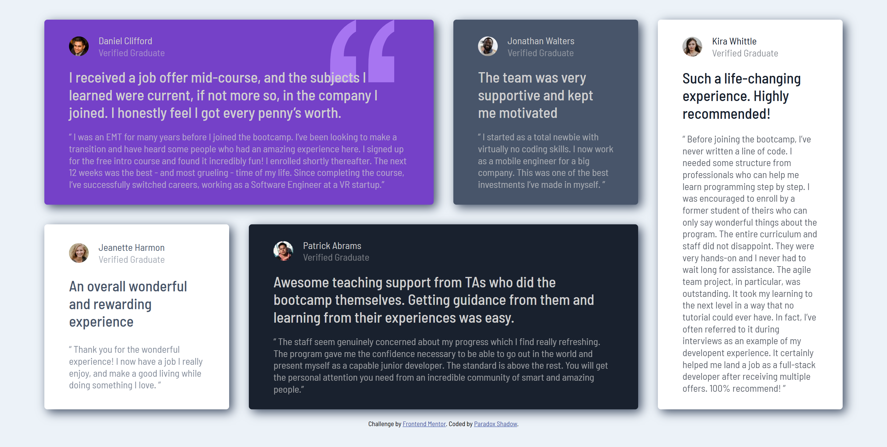

# Frontend Mentor - Testimonials grid section solution

This is a solution to the [Testimonials grid section challenge on Frontend Mentor](https://www.frontendmentor.io/challenges/testimonials-grid-section-Nnw6J7Un7). Frontend Mentor challenges help you improve your coding skills by building realistic projects. 

## Table of contents

- [Overview](#overview)
  - [The challenge](#the-challenge)
  - [Screenshot](#screenshot)
  - [Links](#links)
- [My process](#my-process)
  - [Built with](#built-with)
  - [What I learned](#what-i-learned)
  - [Continued development](#continued-development)
  - [Useful resources](#useful-resources)
- [Author](#author)
- [Acknowledgments](#acknowledgments)


## Overview

### The challenge

Users should be able to:

- View the optimal layout for the site depending on their device's screen size

### Screenshot




### Links

- Solution URL: [Solution](https://your-solution-url.com)
- Live Site URL: [Live Site](https://taresta.github.io/Testimonial-Grid-Section/)

## My process

### Built with

- Semantic HTML5 markup
- SASS for modular and reusable styling
- Flexbox
- CSS Grid
- Mobile-first workflows


### What I learned
### What I learned

This project provided a unique experience, particularly in the way I approached layout and styling. I tried SASS for the first time, and it's been a game-changer for organizing my styles. I also gained more hands-on experience with Flexbox and CSS Grid, and while there's still much to learn, I'm excited for future challenges.

One specific challenge was aligning the `user-info` div. Initially, I thought using Flexbox or Grid for such a small area might be overkill since I assumed these tools were best suited for larger layouts. This project taught me, however, that Flexbox and Grid are incredibly versatile; they’re just as useful for handling intricate details as they are for structuring entire layouts.  

While I once hesitated to use these tools on smaller sections, I've come to see that Flexbox and Grid are not only powerful but also "humble." They adapt seamlessly to any task, big or small, and can be trusted to handle everything with precision. Moving forward, I’ll try to stop being overly cautious and embrace their full potential, appreciating that they make alignment and structure simpler, regardless of the area’s size.

```css
body {
  display: flex;
  flex-direction: column;
  justify-content: center;
  gap: 1rem;
  min-height:100vh;
}
```

**Note: Delete this note and the content within this section and replace with your own learnings.**

### Continued development

Continue working on learning SASS and the responsive layout.

## Author

- Website - [Paradox Shadow](https://github.com/Taresta)
- Frontend Mentor - [Paradox](https://www.frontendmentor.io/profile/Taresta)


## Acknowledgments
Thanks to all the useful resources out there and thanks to my wonderful teacher.
